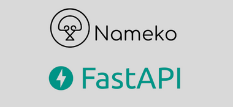

<h1 align="center">
    
</h1>

<h2 align="center" id="about">Ops | Back-end Python Developer</h2>

Challenge project using nameko and fastapi.

  

  
  
  

  
   

  

## 💻 Table of Contents

* [About](#about)
* [Table of Contents](#💻-table-of-contents)
* [Technologies](#🛠-technologies)
* [Project](#🚀-project)
    * [Management](#management)
    * [Requirements](#requirements)
    * [Implementation/Running]
    * [Tests]
* [Questions and Answers]
* [Licence](#📝-licence)

## 🛠 Technologies
- 

- 

- 

- 

- 

- 

## 🚀 Project

### Management
To follow the project's evolution access the [Trello](https://trello.com/invite/b/6zuDLlg9/a4db0528b0884370149b15c5ad68f059/nameko-fastapi) link

### Requirements
- Follow [README-DevEnv.md](https://github.com/gitricko/nameko-devex/blob/master/README-DevEnv.md) to setup dev environment for exercise

## 💡 Questions
>✓ Question 1: Why is performance degrading as the test run longer?
 

>✓ Question 2: How do you fix it?

## 📝 licence

This project is under MIT licence.

Made with ❤️ by Ricardo Taverna

